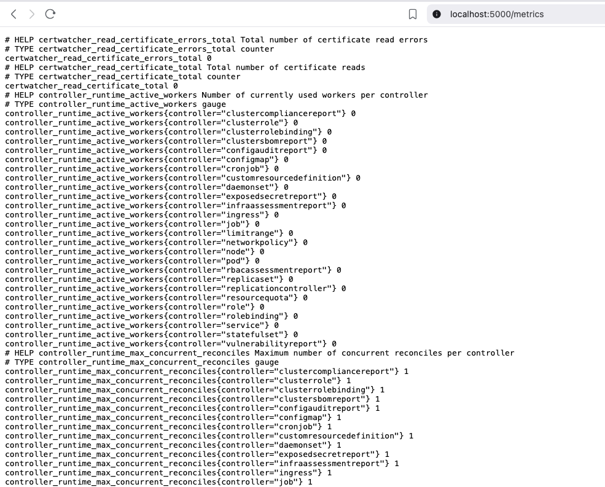
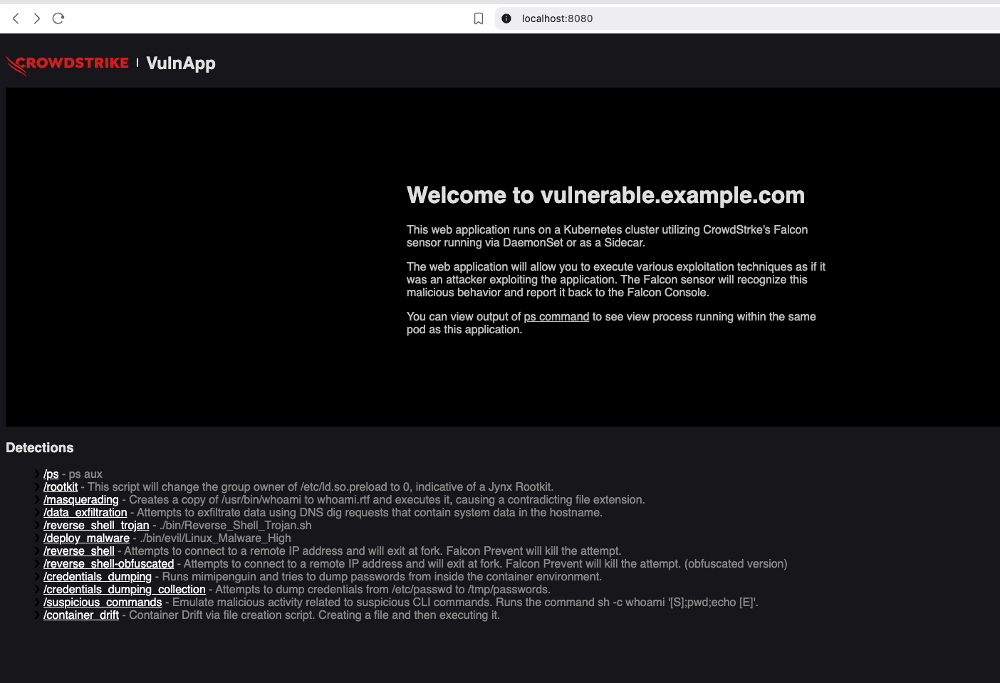

# 🛡️ Kubernetes Security Monitoring Lab

[](https://kubernetes.io/)
[](https://helm.sh/)
[](LICENSE)

A practical lab for Kubernetes security monitoring with Prometheus, Grafana, and Trivy Operator. This guide will help you set up a complete security monitoring stack on your local macOS environment using Docker.

## 🚀 Features

- ✅ **Real-time monitoring** with Prometheus + Grafana
- ✅ **Vulnerability scanning** with Trivy Operator  
- ✅ **Pre-configured dashboards** and alerts
- ✅ **Vulnerable applications** for testing
- ✅ **Multi-node Kubernetes cluster** (Docker Desktop)

## 📋 Prerequisites

### 🖥️ macOS Tools
```bash
# Required tools
brew install kubectl helm k9s
```

### Docker Desktop (from docker.com)


```bash
# Check tools are installed
kubectl version --client
helm version
docker version

# Verify Kubernetes cluster (Docker Desktop)
kubectl get nodes
# Should show: 1 control-plane + 1 worker node
```

## ⚡ Quick Installation

### 1. Install Kube-Prometheus-Stack

### Add Helm Repository and Update
```bash
helm repo add prometheus-community https://prometheus-community.github.io/helm-charts
helm repo update
```

```bash
helm upgrade --install prometheus prometheus-community/kube-prometheus-stack \
  --version 45.7.1 \
  --namespace monitoring \
  --create-namespace \
  --values obs-conf/prom-values.yml
```

### ✅ Validate Installation
```bash
# Check pods status
kubectl get pods -n monitoring --watch

# Verify all components are running
kubectl get all -n monitoring
```

### 🌐 Access Dashboards (Port Forwarding)
```bash
# Access Grafana Dashboard
kubectl port-forward svc/prometheus-grafana -n monitoring 3000:80

# Access Prometheus UI
kubectl port-forward svc/prometheus-operated -n monitoring 9090:9090
```

- **Grafana Access** : http://localhost:3000
- **Credentials**: admin / prom-operator
- **Prometheus Access**: http://localhost:9090


### 🛡️ 2. Install Trivy Operator

### Add Helm Repository and Update
```bash
helm repo add aqua https://aquasecurity.github.io/helm-charts
helm repo update
```

```bash
helm upgrade --install trivy-operator aqua/trivy-operator \
  --namespace trivy-system \
  --create-namespace \
  --version v0.30.0 \
  --values obs-conf/trivy-values.yml
```

### ✅ Validate Trivy Installation
```bash
# Check Trivy Operator pods
kubectl get pods -n trivy-system

# Verify node collectors are running on all nodes
kubectl get pods -n trivy-system -o wide | grep node-collector

# Check vulnerability reports
kubectl get vulnerabilityreports --all-namespaces
```

### 🌐 Access Trivy metrics (Port Forwarding)
```bash
kubectl port-forward svc/trivy-operator -n trivy-system 5000:8080
```



### 🌐 Access Points Summary

| Service | Port Forward Command | URL |
|---------|----------------------|-----|
| **Grafana** | `kubectl port-forward svc/prometheus-grafana -n monitoring 3000:80` | http://localhost:3000 |
| **Prometheus** | `kubectl port-forward svc/prometheus-operated -n monitoring 9090:9090` | http://localhost:9090 |


### 🎯 3. Deploy Vulnerable Applications

```bash
# Create a namespace for security testing
kubectl create namespace security-demo

# Deploy both vulnerable applications to the security-demo namespace
kubectl apply -f app-manifests/vulnapp-crowdstrike.yml -n security-demo
kubectl apply -f app-manifests/vulnapp-example.yml -n security-demo

# Verify applications are running in the correct namespace
kubectl get pods -n security-demo

# If you need to port-forward, use the correct namespace and service name
# First check the service names in your security-demo namespace:
kubectl get svc -n security-demo

# Then port-forward (example - replace with your actual service name):
kubectl port-forward svc/vulnerable-example-com -n security-demo 8080:80
```



## 📊 Trivy CLI Reports Summary

### 🔍 Basic Vulnerability Reports

```bash
# Summary of all vulnerabilities in cluster
trivy k8s --report summary

# Detailed vulnerability report with tolerations for control-plane
trivy k8s --report summary --tolerations node-role.kubernetes.io/control-plane="":NoSchedule

# Get all vulnerability reports across namespaces
kubectl get vulnerabilityreports --all-namespaces -o wide
```

### 🕵️‍♂️ Secret Scanning
```bash
# Scan for exposed secrets in default namespace
trivy k8s --scanners=secret --report=summary --include-namespaces default

# Get detailed exposed secret reports
kubectl describe exposedsecretreport -n <namespace>

# List all exposed secret reports
kubectl get exposedsecretreports -A
```

### 🏗️ Infrastructure & Configuration Assessment
```bash
# Get cluster infrastructure assessment reports
kubectl get clusterinfraassessmentreports -o wide

# Scan for misconfigurations
trivy k8s --scanners=misconfig --report=summary

# CIS compliance scan for Kubernetes 1.23
trivy k8s --compliance=k8s-cis-1.23 --report all
```

### 🎯 Targeted Scans
```bash
# Scan specific namespace (default)
trivy k8s --report summary --include-namespaces security-demo

# Scan kube-system namespace only
trivy k8s --include-namespaces kube-system --report summary

# Scan only for HIGH severity vulnerabilities
trivy k8s --severity=HIGH --report=all --include-namespaces security-demo
```

### 📋 Comprehensive Scans
```bash
# Complete vulnerability scan with all details
trivy k8s --scanners vuln --report all

# Combined scan: vulnerabilities + secrets
trivy k8s --scanners=vuln,secret --report=summary

# Full cluster scan with all scanners
trivy k8s --scanners=vuln,secret,misconfig,config --report all
```


### 📊 Output Formats
```bash
# JSON format for automation
trivy k8s --report summary --format json

# HTML report
trivy k8s --report all --format html > security-report.html

# CSV output
trivy k8s --report summary --format csv > scan-results.csv
```


## 🚀 Quick Cheat Sheet

| Purpose | Command |
|---------|---------|
| **Quick Summary** | `trivy k8s --report summary` |
| **High Severity Only** | `trivy k8s --severity=HIGH,CRITICAL --report=summary` |
| **Secrets Scan** | `trivy k8s --scanners=secret --report=summary` |
| **Compliance Check** | `trivy k8s --compliance=k8s-cis-1.23 --report summary` |
| **Namespace Specific** | `trivy k8s --include-namespaces default --report summary` |