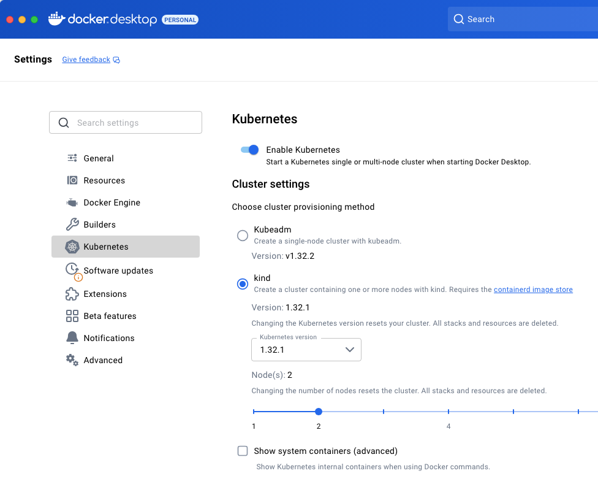
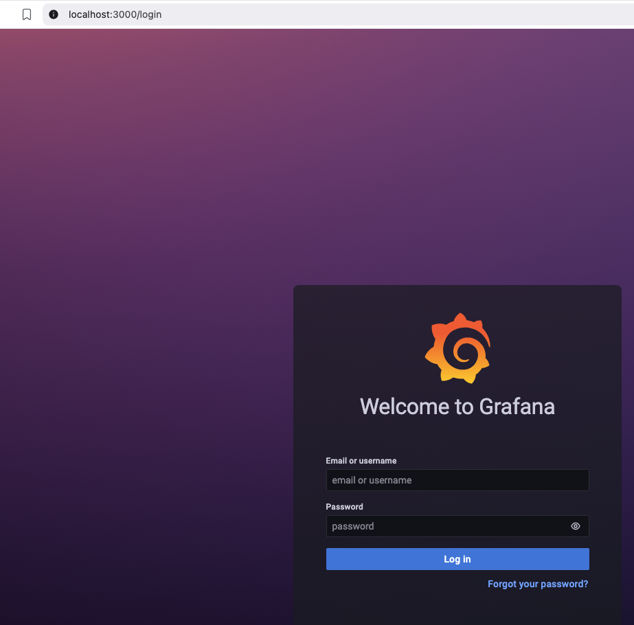
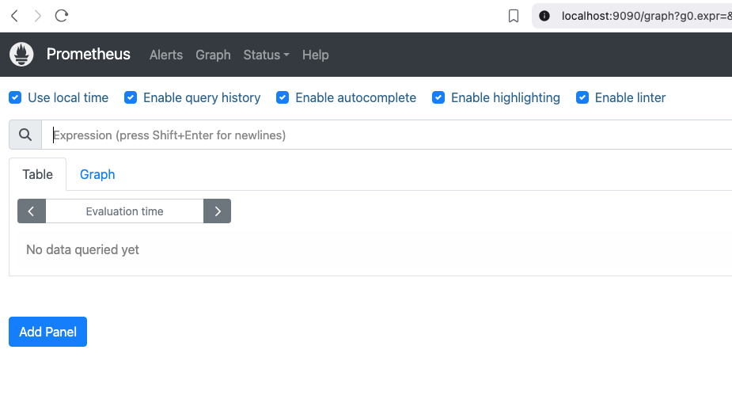

# 🛡️ Kubernetes Security Monitoring Lab

[](https://kubernetes.io/)
[](https://helm.sh/)
[](LICENSE)

A practical lab for Kubernetes security monitoring with Prometheus, Grafana, and Trivy Operator. This guide will help you set up a complete security monitoring stack on your local macOS environment using Docker.

## 🚀 Features

- ✅ **Real-time monitoring** with Prometheus + Grafana
- ✅ **Vulnerability scanning** with Trivy Operator  
- ✅ **Pre-configured dashboards** and alerts
- ✅ **Vulnerable applications** for testing
- ✅ **Multi-node Kubernetes cluster** (Docker Desktop)

## 📋 Prerequisites

### 🖥️ macOS Tools
```bash
# Required tools
brew install kubectl helm k9s
```

### Docker Desktop (from docker.com)


```bash
# Check tools are installed
kubectl version --client
helm version
docker version

# Verify Kubernetes cluster (Docker Desktop)
kubectl get nodes
# Should show: 1 control-plane + 1 worker node
```

## ⚡ Quick Installation

### Add Helm Repository and Update
```bash
helm repo add prometheus-community https://prometheus-community.github.io/helm-charts
helm repo update
```

### Install Kube-Prometheus-Stack
```bash
helm upgrade --install prometheus prometheus-community/kube-prometheus-stack \
  --version 45.7.1 \
  --namespace monitoring \
  --create-namespace \
  --values obs-conf/prom-values.yml
```

### ✅ Validate Installation
```bash
# Check pods status
kubectl get pods -n monitoring --watch

# Verify all components are running
kubectl get all -n monitoring
```

### 🌐 Access Dashboards (Port Forwarding)
```bash
# Access Grafana Dashboard
kubectl port-forward svc/prometheus-grafana -n monitoring 3000:80

# Access Prometheus UI
kubectl port-forward svc/prometheus-operated -n monitoring 9090:9090
```

- **Grafana Access** : http://localhost:3000
- **Credentials**: admin / prom-operator
- **Prometheus Access**: http://localhost:9090



